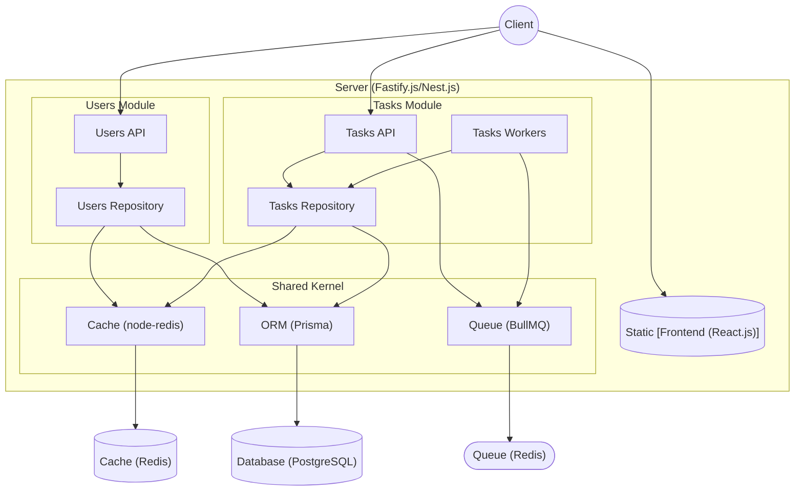
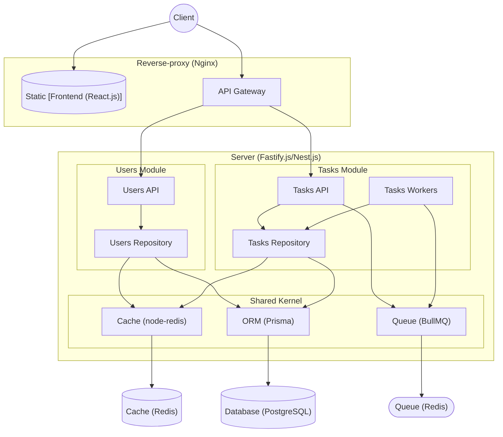
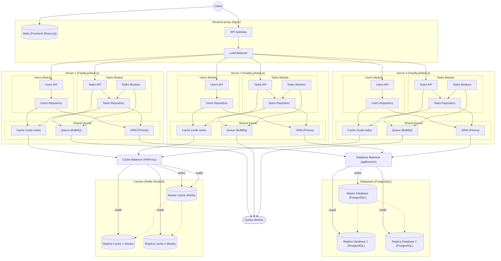

# Карта роста приложения

## Модульный монолит

```mermaid
flowchart
    Client(("Client"))
    Database[("Database (PostgreSQL)")]
    Cache[("Cache (Redis)")]
    Queue(["Queue (Redis)"])
    subgraph Server["Server (Fastify.js/Nest.js)"]
        subgraph SharedKernel["Shared Kernel"]
            CacheProvider["Cache (node-redis)"]
            DatabaseProvider["ORM (Prisma)"]
            QueueProvider["Queue (BullMQ)"]
        end
        subgraph UsersModule["Users Module"]
            UsersModuleApi["Users API"]
            UsersModuleRepository["Users Repository"]
        end
        subgraph TasksModule["Tasks Module"]
            TasksModuleApi["Tasks API"]
            TasksModuleWorkers["Tasks Workers"]
            TasksModuleRepository["Tasks Repository"]
        end
        Static[("Static [Frontend (React.js)]")]
    end

    Client --> UsersModuleApi
    UsersModuleApi --> UsersModuleRepository
    UsersModuleRepository --> CacheProvider
    UsersModuleRepository --> DatabaseProvider

    Client --> TasksModuleApi
    TasksModuleApi --> TasksModuleRepository
    TasksModuleApi --> QueueProvider
    TasksModuleWorkers --> TasksModuleRepository
    TasksModuleWorkers --> QueueProvider
    TasksModuleRepository --> CacheProvider
    TasksModuleRepository --> DatabaseProvider

    CacheProvider --> Cache
    QueueProvider --> Queue
    DatabaseProvider --> Database

    Client --> Static
    Client ~~~~~ Static
```

## Монолит с reverse-proxy

```mermaid
flowchart
    Client(("Client"))
    Database[("Database (PostgreSQL)")]
    Cache[("Cache (Redis)")]
    Queue(["Queue (Redis)"])
    subgraph ReverseProxy["Reverse-proxy (Nginx)"]
        Static[("Static [Frontend (React.js)]")]
        ApiGateway["API Gateway"]
    end
    subgraph Server["Server (Fastify.js/Nest.js)"]
        subgraph SharedKernel["Shared Kernel"]
            CacheProvider["Cache (node-redis)"]
            DatabaseProvider["ORM (Prisma)"]
            QueueProvider["Queue (BullMQ)"]
        end
        subgraph UsersModule["Users Module"]
            UsersModuleApi["Users API"]
            UsersModuleRepository["Users Repository"]
        end
        subgraph TasksModule["Tasks Module"]
            TasksModuleApi["Tasks API"]
            TasksModuleWorkers["Tasks Workers"]
            TasksModuleRepository["Tasks Repository"]
        end
    end

    Client --> Static
    Client --> ApiGateway

    ApiGateway --> UsersModuleApi
    UsersModuleApi --> UsersModuleRepository
    UsersModuleRepository --> CacheProvider
    UsersModuleRepository --> DatabaseProvider

    ApiGateway --> TasksModuleApi
    TasksModuleApi --> TasksModuleRepository
    TasksModuleApi --> QueueProvider
    TasksModuleWorkers --> TasksModuleRepository
    TasksModuleWorkers --> QueueProvider
    TasksModuleRepository --> CacheProvider
    TasksModuleRepository --> DatabaseProvider

    CacheProvider --> Cache
    QueueProvider --> Queue
    DatabaseProvider --> Database
```

## Монолит с балансировщиком 

```mermaid
flowchart
    Client(("Client"))
    Database[("Database (PostgreSQL)")]
    Cache[("Cache (Redis)")]
    Queue(["Queue (Redis)"])
    subgraph ReverseProxy["Reverse-proxy (Nginx)"]
        Static[("Static [Frontend (React.js)]")]
        ApiGateway["API Gateway"]
        LoadBalancer["Load Balancer"]
    end
    subgraph Server1["Server 1 (Fastify.js/Nest.js)"]
        subgraph SharedKernel1["Shared Kernel"]
            CacheProvider1["Cache (node-redis)"]
            DatabaseProvider1["ORM (Prisma)"]
            QueueProvider1["Queue (BullMQ)"]
        end
        subgraph UsersModule1["Users Module"]
            UsersModuleApi1["Users API"]
            UsersModuleRepository1["Users Repository"]
        end
        subgraph TasksModule1["Tasks Module"]
            TasksModuleApi1["Tasks API"]
            TasksModuleWorkers1["Tasks Workers"]
            TasksModuleRepository1["Tasks Repository"]
        end
    end
    subgraph Server2["Server 2 (Fastify.js/Nest.js)"]
        subgraph SharedKernel2["Shared Kernel"]
            CacheProvider2["Cache (node-redis)"]
            DatabaseProvider2["ORM (Prisma)"]
            QueueProvider2["Queue (BullMQ)"]
        end
        subgraph UsersModule2["Users Module"]
            UsersModuleApi2["Users API"]
            UsersModuleRepository2["Users Repository"]
        end
        subgraph TasksModule2["Tasks Module"]
            TasksModuleApi2["Tasks API"]
            TasksModuleWorkers2["Tasks Workers"]
            TasksModuleRepository2["Tasks Repository"]
        end
    end
    subgraph Server3["Server 3 (Fastify.js/Nest.js)"]
        subgraph SharedKernel3["Shared Kernel"]
            CacheProvider3["Cache (node-redis)"]
            DatabaseProvider3["ORM (Prisma)"]
            QueueProvider3["Queue (BullMQ)"]
        end
        subgraph UsersModule3["Users Module"]
            UsersModuleApi3["Users API"]
            UsersModuleRepository3["Users Repository"]
        end
        subgraph TasksModule3["Tasks Module"]
            TasksModuleApi3["Tasks API"]
            TasksModuleWorkers3["Tasks Workers"]
            TasksModuleRepository3["Tasks Repository"]
        end
    end

    Client --> Static
    Client --> ApiGateway
    ApiGateway --> LoadBalancer

    LoadBalancer --> UsersModuleApi1
    UsersModuleApi1 --> UsersModuleRepository1
    UsersModuleRepository1 --> CacheProvider1
    UsersModuleRepository1 --> DatabaseProvider1

    LoadBalancer --> TasksModuleApi1
    TasksModuleApi1 --> TasksModuleRepository1
    TasksModuleApi1 --> QueueProvider1
    TasksModuleWorkers1 --> TasksModuleRepository1
    TasksModuleWorkers1 --> QueueProvider1
    TasksModuleRepository1 --> CacheProvider1
    TasksModuleRepository1 --> DatabaseProvider1

    CacheProvider1 --> Cache
    QueueProvider1 --> Queue
    DatabaseProvider1 --> Database

    LoadBalancer --> UsersModuleApi2
    UsersModuleApi2 --> UsersModuleRepository2
    UsersModuleRepository2 --> CacheProvider2
    UsersModuleRepository2 --> DatabaseProvider2

    LoadBalancer --> TasksModuleApi2
    TasksModuleApi2 --> TasksModuleRepository2
    TasksModuleApi2 --> QueueProvider2
    TasksModuleWorkers2 --> TasksModuleRepository2
    TasksModuleWorkers2 --> QueueProvider2
    TasksModuleRepository2 --> CacheProvider2
    TasksModuleRepository2 --> DatabaseProvider2

    CacheProvider2 --> Cache
    QueueProvider2 --> Queue
    DatabaseProvider2 --> Database

    LoadBalancer --> UsersModuleApi3
    UsersModuleApi3 --> UsersModuleRepository3
    UsersModuleRepository3 --> CacheProvider3
    UsersModuleRepository3 --> DatabaseProvider3

    LoadBalancer --> TasksModuleApi3
    TasksModuleApi3 --> TasksModuleRepository3
    TasksModuleApi3 --> QueueProvider3
    TasksModuleWorkers3 --> TasksModuleRepository3
    TasksModuleWorkers3 --> QueueProvider3
    TasksModuleRepository3 --> CacheProvider3
    TasksModuleRepository3 --> DatabaseProvider3

    CacheProvider3 --> Cache
    QueueProvider3 --> Queue
    DatabaseProvider3 --> Database
```

## Монолит с репликацией данных

```mermaid
flowchart
    Client(("Client"))
    subgraph ReverseProxy["Reverse-proxy (Nginx)"]
        Static[("Static [Frontend (React.js)]")]
        ApiGateway["API Gateway"]
        LoadBalancer["Load Balancer"]
    end
    subgraph Server1["Server 1 (Fastify.js/Nest.js)"]
        subgraph SharedKernel1["Shared Kernel"]
            CacheProvider1["Cache (node-redis)"]
            DatabaseProvider1["ORM (Prisma)"]
            QueueProvider1["Queue (BullMQ)"]
        end
        subgraph UsersModule1["Users Module"]
            UsersModuleApi1["Users API"]
            UsersModuleRepository1["Users Repository"]
        end
        subgraph TasksModule1["Tasks Module"]
            TasksModuleApi1["Tasks API"]
            TasksModuleWorkers1["Tasks Workers"]
            TasksModuleRepository1["Tasks Repository"]
        end
    end
    subgraph Server2["Server 2 (Fastify.js/Nest.js)"]
        subgraph SharedKernel2["Shared Kernel"]
            CacheProvider2["Cache (node-redis)"]
            DatabaseProvider2["ORM (Prisma)"]
            QueueProvider2["Queue (BullMQ)"]
        end
        subgraph UsersModule2["Users Module"]
            UsersModuleApi2["Users API"]
            UsersModuleRepository2["Users Repository"]
        end
        subgraph TasksModule2["Tasks Module"]
            TasksModuleApi2["Tasks API"]
            TasksModuleWorkers2["Tasks Workers"]
            TasksModuleRepository2["Tasks Repository"]
        end
    end
    subgraph Server3["Server 3 (Fastify.js/Nest.js)"]
        subgraph SharedKernel3["Shared Kernel"]
            CacheProvider3["Cache (node-redis)"]
            DatabaseProvider3["ORM (Prisma)"]
            QueueProvider3["Queue (BullMQ)"]
        end
        subgraph UsersModule3["Users Module"]
            UsersModuleApi3["Users API"]
            UsersModuleRepository3["Users Repository"]
        end
        subgraph TasksModule3["Tasks Module"]
            TasksModuleApi3["Tasks API"]
            TasksModuleWorkers3["Tasks Workers"]
            TasksModuleRepository3["Tasks Repository"]
        end
    end
    DatabaseLoadBalancer["Database Balancer (pgBouncer)"]
    subgraph Databases["Databases (PostgreSQL)"]
        MasterDatabase[("Master Database (PostgreSQL)")]
        ReplicaDatabase1[("Replica Database 1 (PostgreSQL)")]
        ReplicaDatabase2[("Replica Database 2 (PostgreSQL)")]
    end
    CacheLoadBalancer["Cache Balancer (HAProxy)"]
    subgraph Caches["Caches (Redis Sentinel)"]
        MasterCache[("Master Cache (Redis)")]
        ReplicaCache1[("Replica Cache 1 (Redis)")]
        ReplicaCache2[("Replica Cache 2 (Redis)")]
    end
    Queue(["Queue (Redis)"])

    Client --> Static
    Client --> ApiGateway
    ApiGateway --> LoadBalancer

    LoadBalancer --> UsersModuleApi1
    UsersModuleApi1 --> UsersModuleRepository1
    UsersModuleRepository1 --> CacheProvider1
    UsersModuleRepository1 --> DatabaseProvider1

    LoadBalancer --> TasksModuleApi1
    TasksModuleApi1 --> TasksModuleRepository1
    TasksModuleApi1 --> QueueProvider1
    TasksModuleWorkers1 --> TasksModuleRepository1
    TasksModuleWorkers1 --> QueueProvider1
    TasksModuleRepository1 --> CacheProvider1
    TasksModuleRepository1 --> DatabaseProvider1

    CacheProvider1 --> CacheLoadBalancer
    QueueProvider1 --> Queue
    DatabaseProvider1 --> DatabaseLoadBalancer

    LoadBalancer --> UsersModuleApi2
    UsersModuleApi2 --> UsersModuleRepository2
    UsersModuleRepository2 --> CacheProvider2
    UsersModuleRepository2 --> DatabaseProvider2

    LoadBalancer --> TasksModuleApi2
    TasksModuleApi2 --> TasksModuleRepository2
    TasksModuleApi2 --> QueueProvider2
    TasksModuleWorkers2 --> TasksModuleRepository2
    TasksModuleWorkers2 --> QueueProvider2
    TasksModuleRepository2 --> CacheProvider2
    TasksModuleRepository2 --> DatabaseProvider2

    CacheProvider2 --> CacheLoadBalancer
    QueueProvider2 --> Queue
    DatabaseProvider2 --> DatabaseLoadBalancer

    LoadBalancer --> UsersModuleApi3
    UsersModuleApi3 --> UsersModuleRepository3
    UsersModuleRepository3 --> CacheProvider3
    UsersModuleRepository3 --> DatabaseProvider3

    LoadBalancer --> TasksModuleApi3
    TasksModuleApi3 --> TasksModuleRepository3
    TasksModuleApi3 --> QueueProvider3
    TasksModuleWorkers3 --> TasksModuleRepository3
    TasksModuleWorkers3 --> QueueProvider3
    TasksModuleRepository3 --> CacheProvider3
    TasksModuleRepository3 --> DatabaseProvider3

    CacheProvider3 --> CacheLoadBalancer
    QueueProvider3 --> Queue
    DatabaseProvider3 --> DatabaseLoadBalancer

    CacheLoadBalancer --writes--> MasterCache
    CacheLoadBalancer --reads--> MasterCache
    CacheLoadBalancer --reads--> ReplicaCache1
    CacheLoadBalancer --reads--> ReplicaCache2
    MasterCache -..-> ReplicaCache1
    MasterCache -..-> ReplicaCache2

    DatabaseLoadBalancer --writes--> MasterDatabase
    DatabaseLoadBalancer --reads--> ReplicaDatabase1
    DatabaseLoadBalancer --reads--> ReplicaDatabase2
    MasterDatabase -..-> ReplicaDatabase1
    MasterDatabase -..-> ReplicaDatabase2

    Caches ~~~ Queue
    Databases ~~~ Queue
```

## Микросервисы

```mermaid
flowchart
    Client(("Client"))
    ServiceDiscovery["Service Discovery (Consul)"]
    subgraph ReverseProxy["Reverse-proxy (Nginx)"]
        Static[("Static [Frontend (React.js)]")]
        ApiGateway["API Gateway)"]
        UsersLoadBalancer["Users Load Balancer"]
        TasksLoadBalancer["Tasks Load Balancer"]
    end
    subgraph UsersServices["Users Services"]
        subgraph UsersService1["Users Service 1 (Fastify.js/Nest.js)"]
            UsersCacheProvider1["Cache (node-redis)"]
            UsersDatabaseProvider1["ORM (Prisma)"]
            UsersPubSubProvider1["Pub/Sub (node-redis)"]
            UsersModuleApi1["Users API"]
            UsersModuleRepository1["Users Repository"]
        end
        subgraph UsersService2["Users Service 2 (Fastify.js/Nest.js)"]
            UsersCacheProvider2["Cache (node-redis)"]
            UsersDatabaseProvider2["ORM (Prisma)"]
            UsersPubSubProvider2["Pub/Sub (node-redis)"]
            UsersModuleApi2["Users API"]
            UsersModuleRepository2["Users Repository"]
        end
    end
    subgraph TasksServices["Tasks Services"]
        subgraph TasksService1["Tasks Service 1 (Fastify.js/Nest.js)"]
            TasksCacheProvider1["Cache (node-redis)"]
            TasksDatabaseProvider1["ORM (Prisma)"]
            TasksQueueProvider1["Queue (BullMQ)"]
            TasksPubSubProvider1["Pub/Sub (node-redis)"]
            TasksRpcProvider1["RPC"]
            TasksModuleApi1["Tasks API"]
            TasksModuleWorkers1["Tasks Workers"]
            TasksModuleRepository1["Tasks Repository"]
        end
        subgraph TasksService2["Tasks Service 2 (Fastify.js/Nest.js)"]
            TasksCacheProvider2["Cache (node-redis)"]
            TasksDatabaseProvider2["ORM (Prisma)"]
            TasksQueueProvider2["Queue (BullMQ)"]
            TasksPubSubProvider2["Pub/Sub (node-redis)"]
            TasksRpcProvider2["RPC"]
            TasksModuleApi2["Tasks API"]
            TasksModuleWorkers2["Tasks Workers"]
            TasksModuleRepository2["Tasks Repository"]
        end
        subgraph TasksService3["Tasks Service 3 (Fastify.js/Nest.js)"]
            TasksCacheProvider3["Cache (node-redis)"]
            TasksDatabaseProvider3["ORM (Prisma)"]
            TasksQueueProvider3["Queue (BullMQ)"]
            TasksPubSubProvider3["Pub/Sub (node-redis)"]
            TasksRpcProvider3["RPC"]
            TasksModuleApi3["Tasks API"]
            TasksModuleWorkers3["Tasks Workers"]
            TasksModuleRepository3["Tasks Repository"]
        end
    end
    DatabaseLoadBalancer["Database Balancer (pgBouncer)"]
    subgraph Databases["Databases (PostgreSQL)"]
        MasterDatabase[("Master Database (PostgreSQL)")]
        ReplicaDatabase1[("Replica Database 1 (PostgreSQL)")]
        ReplicaDatabase2[("Replica Database 2 (PostgreSQL)")]
    end
    CacheLoadBalancer["Cache Balancer (HAProxy)"]
    subgraph Caches["Caches (Redis Sentinel)"]
        MasterCache[("Master Cache (Redis)")]
        ReplicaCache1[("Replica Cache 1 (Redis)")]
        ReplicaCache2[("Replica Cache 2 (Redis)")]
    end
    Queue(["Queue (Redis)"])
    PubSub(["Pub/Sub (Redis)"])

    Client --> Static
    Client --> ApiGateway

    ApiGateway --> UsersLoadBalancer
    UsersLoadBalancer --> ServiceDiscovery

    UsersLoadBalancer --> UsersModuleApi1
    UsersModuleApi1 --> ServiceDiscovery
    UsersModuleApi1 --> UsersModuleRepository1
    UsersModuleRepository1 --> UsersCacheProvider1
    UsersModuleRepository1 --> UsersDatabaseProvider1
    UsersCacheProvider1 --> CacheLoadBalancer
    UsersDatabaseProvider1 --> DatabaseLoadBalancer
    UsersPubSubProvider1 --> PubSub

    UsersLoadBalancer --> UsersModuleApi2
    UsersModuleApi2 --> ServiceDiscovery
    UsersModuleApi2 --> UsersModuleRepository2
    UsersModuleRepository2 --> UsersCacheProvider2
    UsersModuleRepository2 --> UsersDatabaseProvider2
    UsersCacheProvider2 --> CacheLoadBalancer
    UsersDatabaseProvider2 --> DatabaseLoadBalancer
    UsersPubSubProvider2 --> PubSub

    ApiGateway --> TasksLoadBalancer
    TasksLoadBalancer --> ServiceDiscovery

    TasksLoadBalancer --> TasksModuleApi1
    TasksModuleApi1 --> ServiceDiscovery
    TasksModuleApi1 --> TasksModuleRepository1
    TasksModuleApi1 --> TasksQueueProvider1
    TasksModuleApi1 --> TasksRpcProvider1
    TasksModuleWorkers1 --> TasksModuleRepository1
    TasksModuleWorkers1 --> TasksQueueProvider1
    TasksModuleRepository1 --> TasksCacheProvider1
    TasksModuleRepository1 --> TasksDatabaseProvider1
    TasksCacheProvider1 --> CacheLoadBalancer
    TasksQueueProvider1 --> Queue
    TasksPubSubProvider1 --> PubSub
    TasksRpcProvider1 --> ApiGateway
    TasksDatabaseProvider1 --> DatabaseLoadBalancer

    TasksLoadBalancer --> TasksModuleApi2
    TasksModuleApi2 --> ServiceDiscovery
    TasksModuleApi2 --> TasksModuleRepository2
    TasksModuleApi2 --> TasksQueueProvider2
    TasksModuleApi2 --> TasksRpcProvider2
    TasksModuleWorkers2 --> TasksModuleRepository2
    TasksModuleWorkers2 --> TasksQueueProvider2
    TasksModuleRepository2 --> TasksCacheProvider2
    TasksModuleRepository2 --> TasksDatabaseProvider2
    TasksCacheProvider2 --> CacheLoadBalancer
    TasksQueueProvider2 --> Queue
    TasksPubSubProvider2 --> PubSub
    TasksRpcProvider2 --> ReverseProxy
    TasksDatabaseProvider2 --> DatabaseLoadBalancer

    TasksLoadBalancer --> TasksModuleApi3
    TasksModuleApi3 --> ServiceDiscovery
    TasksModuleApi3 --> TasksModuleRepository3
    TasksModuleApi3 --> TasksQueueProvider3
    TasksModuleApi3 --> TasksRpcProvider3 
    TasksModuleWorkers3 --> TasksModuleRepository3
    TasksModuleWorkers3 --> TasksQueueProvider3
    TasksModuleRepository3 --> TasksCacheProvider3
    TasksModuleRepository3 --> TasksDatabaseProvider3
    TasksCacheProvider3 --> CacheLoadBalancer
    TasksQueueProvider3 --> Queue
    TasksPubSubProvider3 --> PubSub
    TasksRpcProvider3 --> ApiGateway
    TasksDatabaseProvider3 --> DatabaseLoadBalancer

    CacheLoadBalancer --writes--> MasterCache
    CacheLoadBalancer --reads--> MasterCache
    CacheLoadBalancer --reads--> ReplicaCache1
    CacheLoadBalancer --reads--> ReplicaCache2
    MasterCache -..-> ReplicaCache1
    MasterCache -..-> ReplicaCache2

    DatabaseLoadBalancer --writes--> MasterDatabase
    DatabaseLoadBalancer --reads--> ReplicaDatabase1
    DatabaseLoadBalancer --reads--> ReplicaDatabase2
    MasterDatabase -..-> ReplicaDatabase1
    MasterDatabase -..-> ReplicaDatabase2

    ReverseProxy ~~~~~ TasksServices
    UsersServices & TasksServices ~~~~ ServiceDiscovery ~~~ Queue ~~~ PubSub ~~~ CacheLoadBalancer ~~~ DatabaseLoadBalancer
```
